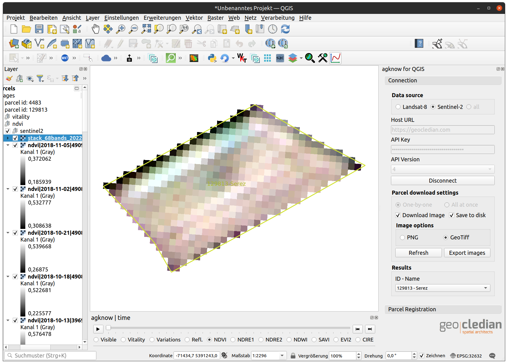

# agknow for QGIS 3.x
This plugin allows the usage of the remote sensing API ag|knowledge from geo|cledian.com. 
The API provides a field monitoring service that allows to monitor any agricultural field worldwide 
with a variety of vegetation indexes, crop parameters, times series analysis and comparison features based on satellite data.

Features of the plugin include the download and analysis of time series of visible and vegetation indexes rasters of registered fields. The data is based on Landsat-8 and Sentinel-2 currently. 
See <a href="https://docs.geocledian.com">https://docs.geocledian.com</a> for a detailed product overwiew.

Please note that you will need a registered API key from geocledian.com to use this plugin for your area of interest. The plugin is delivered with a demo key that allows to access some demo parcels around the world for evaluation purposes.

## Why?
- Convenient tool for Analysts if they want to work with the data of the agknow API directly in a desktop GIS
  especially for GeoTiff reflectances and indices
- Export parcel data
- Viewer for GeoTiff output of the API; the Javascript clients will not work here 

## Change log:
- Version 0.7.5:
  - fixed importing of GDAL
- Version 0.7.3:
  - GUI enhancements
  - store raster images in file system 
  - API versions selectable
- Version 0.7.2:
  - Parcel registering for selected feature from QGIS layer
- Version 0.7.1:
  - Download of all parcels for specified key -> QGIS feature layer
  - Download of all images (PNG or GeoTiff) -> QGIS raster layer
  - Grouping of layers according to their data sources/products/time stamps
  - Timeseries of images with timeslider widget
  - respects current SRS of project for downloading images/parcels from agknow API
  - anything happens in memory (vector and image data)

## Installation
### QGIS Plugin
In QGIS you can search in the plugins repository for "agknow" and install the latest version.

### Installation without plugin repository
#### Linux
clone git repo to ~/.local/share/QGIS/QGIS3/profiles/default/python/plugins
#### Windows
clone git repo to %APPDATA%\QGIS\QGIS3\profiles\default\python\plugins, i.e.
C:\Users\[USER]\AppData\Roaming\QGIS\QGIS3\profiles\default\python\plugins

## Usage
This plugin may be used to use already processed raster products from our remote sensing API and analyze them.
For example you could combine the [One Click Raster Stacking plugin](https://plugins.qgis.org/plugins/oneclickrasterstacking),
the [Temporal Profile plugin](https://plugins.qgis.org/plugins/temporalprofiletool/) and our agknow plugin to build a raster stack of NDVI time series in 4 simple steps:
- enter your API key (or use the predefined DEMO key), the correct host and click on "Connect"; choose your parcel & desired product (e.g. NDVI)

- select the first raster in the TOC and click on the One Click Raster Stacking button 

- select the stack in the TOC and click on the Temporal Profile plugin 

- now plot a time series of NDVI for any pixel in the stack

### If you don't get a result in the plot of the temporal profile plugin check the following:
- is the stack added to the layer registry of the temporal profile plugin?
- is the QGIS project's CRS different than the stack layer's CRS? There is a known bug in this plugin (https://github.com/DHI-GRAS/qgis-temporal-profile/issues/20).
  To work around this issue just switch the QGIS project's CRS to the raster layer's CRS.
  
  ## Support
This plugin is provided as is and we accept no liability for the source code. In case of bugs or questions please contact [us](mailto:info@geocledian.com). We are also happy to receive feedback. Unfortunately we can only offer very limited technical support, especially about integration in third party software.
